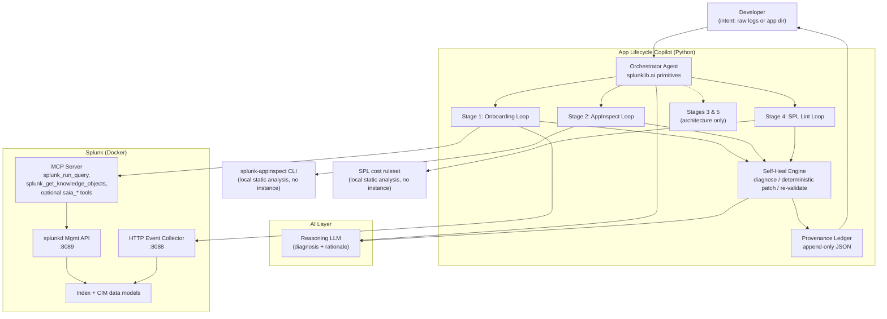

# Architecture Diagram

**Project:** Splunk App Lifecycle Copilot
**Track:** Platform & Developer Experience · **Bonus:** Best Use of Splunk MCP Server

This document satisfies the three required elements: how the application interacts with Splunk, how AI models/agents are integrated, and the data flow between services, APIs, and application components.

---

## System overview

---

## 1. How the application interacts with Splunk

Two distinct interaction paths, one per loop:

**Onboarding loop — live instance.** The copilot ingests the raw log sample through the **HTTP Event Collector (HEC, port 8088)**, then validates candidate field extraction by running real searches against the indexed data. Validation searches go through the **Splunk MCP server** (`splunk_run_query`) using inline SPL `rex` / `eval` candidates, so the loop does not rewrite `props.conf` / `transforms.conf` or reload Splunk on every iteration. Where useful, the agent can inspect existing field extractions, aliases, calculated fields, and data models through `splunk_get_knowledge_objects`, or directly through the **splunkd management API (port 8089)** via the `splunklib` SDK. The loop compares candidate extraction output to the target **CIM data model**, iterating until the extraction is CIM-clean, then emits final conf files only after convergence.

**AppInspect loop — no instance required.** The copilot runs the `splunk-appinspect` CLI as **local static analysis** against the app directory. This path needs no running Splunk at all; it parses the machine-readable JSON report, patches the app, and re-runs until compliant.

Splunk is run locally via `docker compose up` (`splunk/splunk:latest`, trial or Free license). Ports exposed: 8000 (Web), 8088 (HEC), 8089 (management API / MCP).

## 2. How AI models / agents are integrated

**Orchestrator agent.** Built on the Splunk SDK `splunklib.ai` agent primitives (`AgentState`, subagents, tool calls). It interprets developer intent, selects the loop, and drives the run. A reasoning LLM provides planning, diagnosis, and rationale text. It does not directly edit files; concrete changes are handled by deterministic patch functions.

**Splunk MCP server as the action surface.** The agent reaches Splunk's capabilities through the MCP server using the encrypted token generated by the Splunk MCP Server app: `splunk_run_query` validates extractions against real events, and `splunk_get_knowledge_objects` discovers existing Splunk knowledge objects. `saia_generate_spl`, `saia_explain_spl`, and `saia_optimize_spl` are used only when Splunk AI Assistant is installed; the onboarding loop must still succeed with `splunk_run_query` alone. `splunk_run_query` is bounded for safe quick searches (about 1 minute and about 1000 returned events), and the 150-line onboarding fixture is inside those limits. This is the integration the **Best Use of MCP Server** bonus rewards — the agent orchestrating meaningful, real actions across the app lifecycle rather than making a single call.

**Self-heal engine.** A single, artifact-agnostic loop — `diagnose → select deterministic patch → apply → re-validate → repeat` (capped by `SELF_HEAL_MAX_ITERS`). The same engine drives all three loops (onboarding, AppInspect, SPL lint); only the diagnosis source and patch registry differ. This reuse is the platform thesis — adding the SPL lint loop reused the engine verbatim.

## 3. Data flow between services, APIs, and components

**Onboarding loop:**
1. Raw log sample → HEC (:8088) → Splunk index.
2. Orchestrator → local rules / LLM / optional `saia_generate_spl` → candidate inline SPL extraction + CIM mapping.
3. Candidate validation → `splunk_run_query` (MCP → :8089) → extracted-field results from real indexed events.
4. Self-heal engine diagnoses coverage gaps + PII → deterministic patcher adjusts inline `rex` / `eval` candidate → re-searches.
5. On success: final `props.conf` / `transforms.conf` emitted; every iteration written to the provenance ledger.

**AppInspect loop:**
1. Non-compliant app dir → `splunk-appinspect inspect --mode test --data-format json --output-file result.json`.
2. Self-heal engine parses `result.json` failures (check, file, line, message).
3. LLM explains the failure and rationale → deterministic patch function applies the known repair.
4. AppInspect re-run → repeat until zero failures or cap reached.
5. On success: clean app emitted; every fix written to the provenance ledger.

**Cross-cutting:** the **provenance ledger** records one entry per patch across both loops — `{stage, iteration, failure, diagnosis, patch, rationale, validation_result, timestamp}` — giving the developer an auditable trail of every decision the agent made.

---

## Notes on positioning

Splunk's AI Intelligence Reports for AppInspect (early 2026) *explain* failures and surface them in the IDE via MCP. This project's delta is the **closed loop** (diagnose → patch → re-validate → repeat), the **cross-stage provenance**, and the **onboarding integration** — none of which the explain-only feature provides. Splunk explains; this resolves, validates, and remembers.
