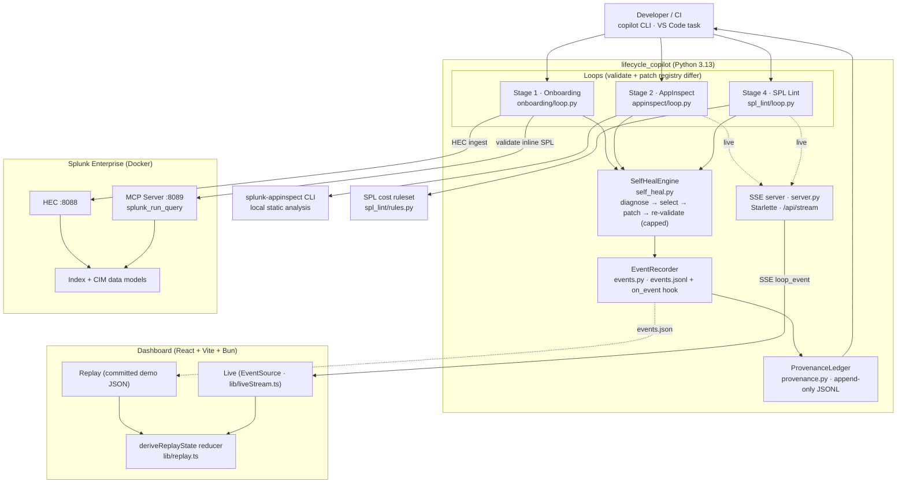
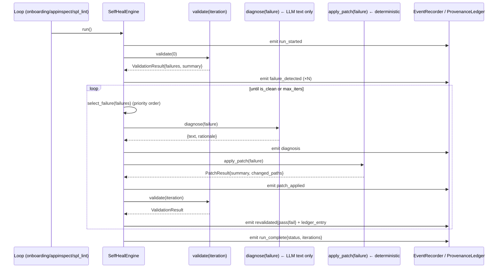
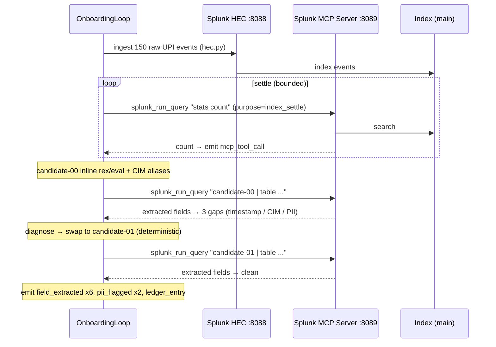
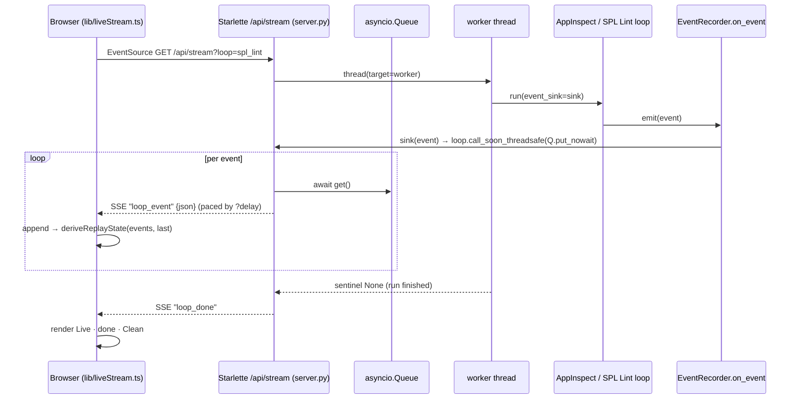
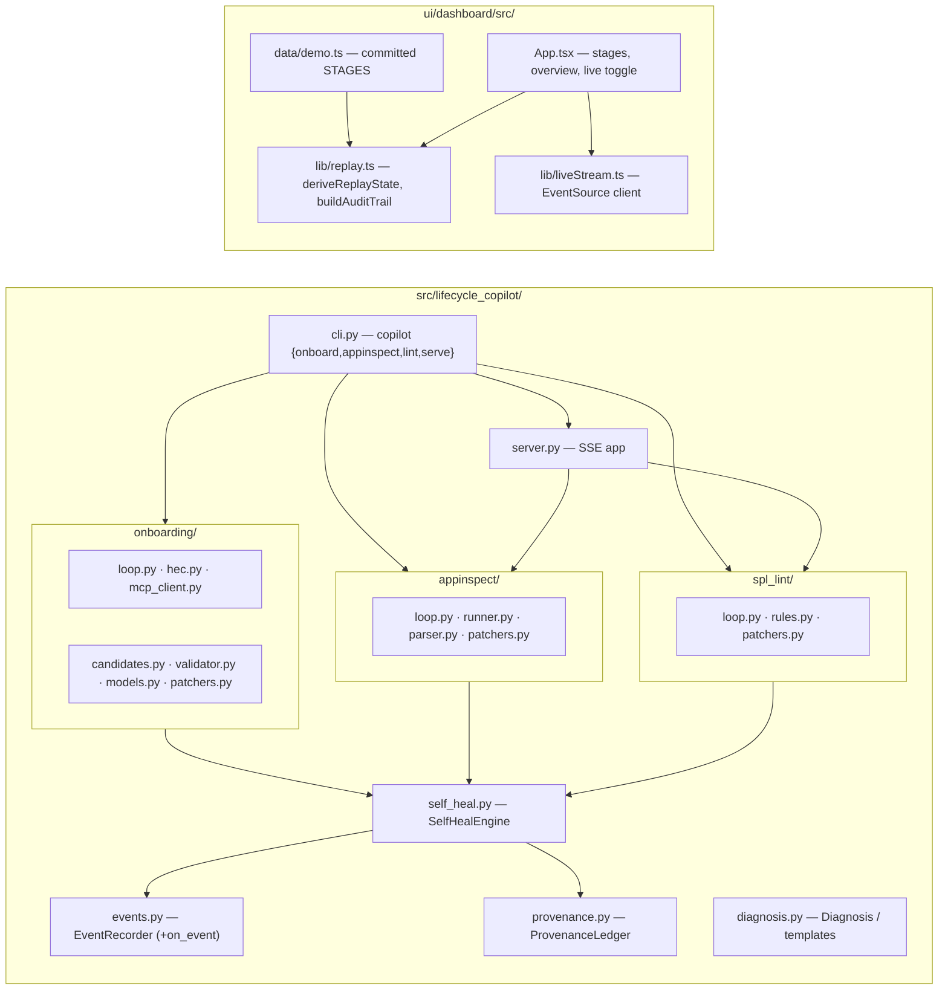

# Architecture — Demo Walkthrough (Technical)

A presentation-ready, technical view of the Splunk App Lifecycle Copilot for the
demo. Every box and arrow maps to real code; module/function names are cited so
the diagrams can be defended live. For the required hackathon artifact see
[`../architecture_diagram.md`](../architecture_diagram.md).

**Thesis:** one artifact-agnostic self-heal engine
(`diagnose → select deterministic patch → apply → re-validate`) drives **three**
loops; the LLM writes diagnosis/rationale *text only*, deterministic patch
functions make every change, and every decision is appended to a provenance
ledger.

---

## 1. System overview



The engine, recorder, and ledger are shared infrastructure. Each loop differs in
exactly two injected callables: how it **validates** and which **patchers** it
selects from.

---

## 2. Shared self-heal engine (the spine)

`SelfHealEngine.run()` (`self_heal.py`) is one loop, parametrized per stage:



`ValidationResult.is_clean` ⇔ `summary.failure == 0 and summary.error == 0`.
The patch registry is a constrained dict (`PATCHERS` per loop); there is no
free-form file editing — that is what keeps runs reproducible and the audit
trail defensible.

| Loop | `validate` source | `select_failure` / patchers | Live Splunk? |
|---|---|---|---|
| Onboarding | `splunk_run_query` over indexed events (MCP) | swap inline `rex`/`eval` candidate | **Yes** |
| AppInspect | `splunk-appinspect inspect --data-format json` | remove `local/`, `user-seed.conf`, `outputs.conf` | No |
| SPL Lint | `lint_spl()` cost ruleset | `index=main` / `earliest=-24h` / `\| sort 1000` rewrites | No |

---

## 3. Onboarding loop — live MCP data flow

The bonus-prize path. `splunk_run_query` is the validation oracle the loop
iterates against, not a one-shot call.



Verified live run (this build): **150 events ingested · 6 real `splunk_run_query`
calls · 3 gaps → 0 · 6 CIM mappings** (`amt→amount`, `status→action`,
`vpa→dest`, `payer_vpa→src_user`, `txn_id→transaction_id`, `gstin→vendor_id`)
**· 2 PII flags** (`payer_vpa`, `payer_mobile`). Auth uses the RSA-encrypted MCP
token (`mcp_client.py`), not a REST bearer token; the loop hard-fails if
`splunk_run_query` is unavailable.

---

## 4. Live mode — SSE streaming runtime

"Go Live" streams a static loop's events as it executes, rendered through the
*same* reducer as replay. Only the event source differs.



The `on_event` hook (`events.py`) is best-effort and wrapped in try/except so a
streaming subscriber can never break a run. Only the static loops are exposed
live (`LIVE_LOOPS = ("appinspect", "spl_lint")`) — both need no Splunk, so the
live demo is dependency-free. CORS is open for the dev origin; `VITE_LIVE_URL`
overrides the default `http://127.0.0.1:8765`.

---

## 5. Module map



Tests: **32 Python** (`tests/`) + **18 dashboard** (`lib/replay.test.ts`), ruff
clean, dashboard `tsc` + `vite build` green.

---

## 6. Event & provenance contract

Every loop emits the same event vocabulary to `events.jsonl` (streamed live via
`on_event`, snapshotted to `events.json` for replay):

`run_started · failure_detected · diagnosis · patch_applied · revalidated ·
ledger_entry · run_complete` — plus onboarding-only `mcp_tool_call`,
`field_extracted`, `pii_flagged`.

Provenance ledger entry (`provenance.jsonl`, one per patch — the "remember"):

```json
{
  "stage": "spl_lint", "iteration": 1,
  "failure": "spl_wildcard_index (costly_search.spl)",
  "diagnosis": "...", "patch": "...", "rationale": "...",
  "validation_result": "pass", "timestamp": "2026-06-13T...Z",
  "failure_id": "spl_lint:spl_wildcard_index",
  "check": "spl_wildcard_index", "file": "costly_search.spl",
  "line": 1, "message": "...", "changed_paths": ["costly_search.spl"]
}
```

The dashboard's Provenance Ledger panel renders this directly
(`buildAuditTrail`), so "trust the fix" and "what the agent did" are the same
artifact.

---

## 7. Stack

| Layer | Tech |
|---|---|
| Agent / loops | Python 3.13, `splunklib` SDK, `mcp` client, `splunk-appinspect` |
| Splunk | `splunk/splunk:latest` (Docker), HEC, Splunk MCP Server app (encrypted token) |
| Live server | Starlette + `sse-starlette`, `uvicorn`, background thread + `asyncio.Queue` |
| Dashboard | React + TypeScript + Vite + Bun, pure reducer, `EventSource` |
| Quality | `pytest`, `ruff`, `vitest`, Playwright (manual responsive checks) |

> Roadmap (architecture-only): Stage 3 scaffold + test-data generation, Stage 5
> Simple XML → Dashboard Studio migration — both target the same engine.
